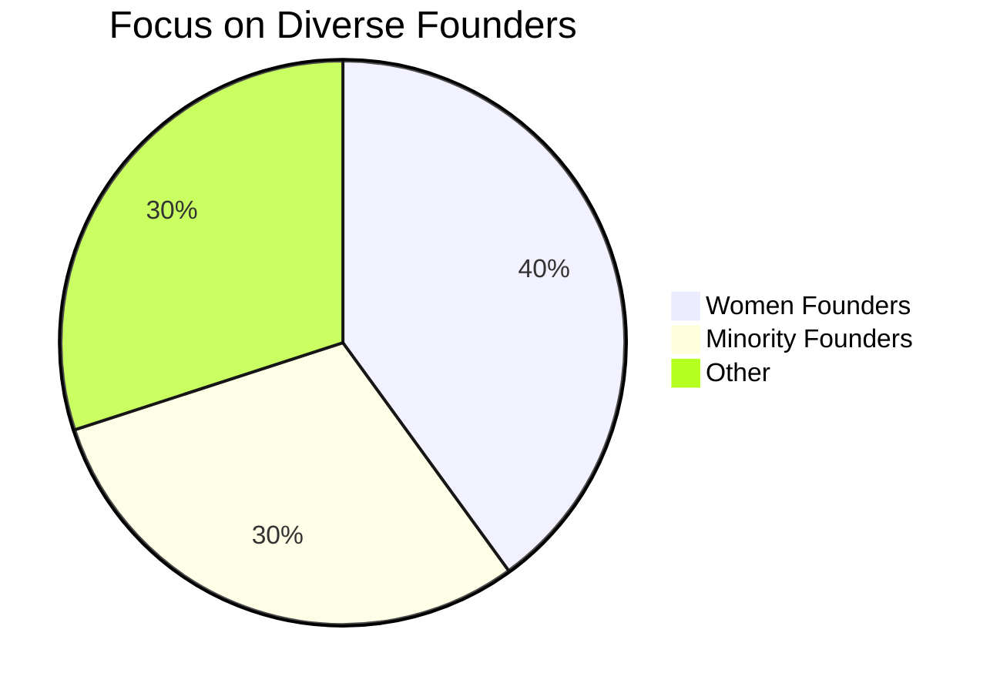
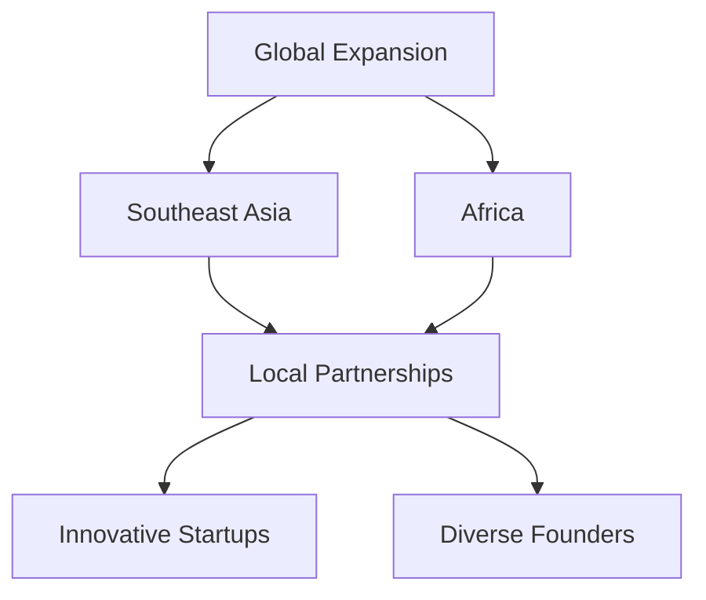
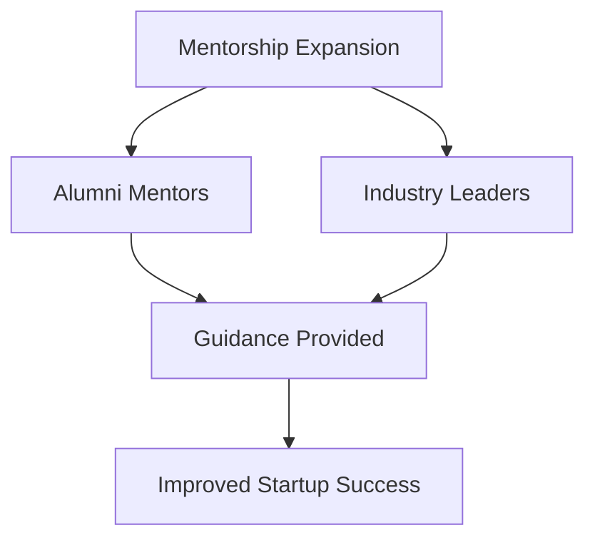
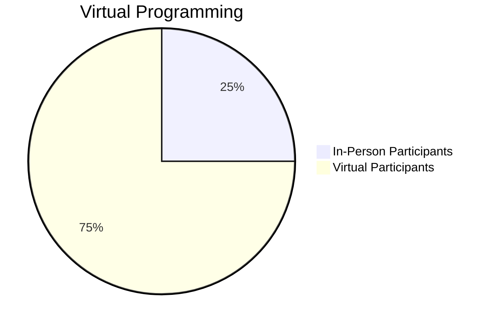
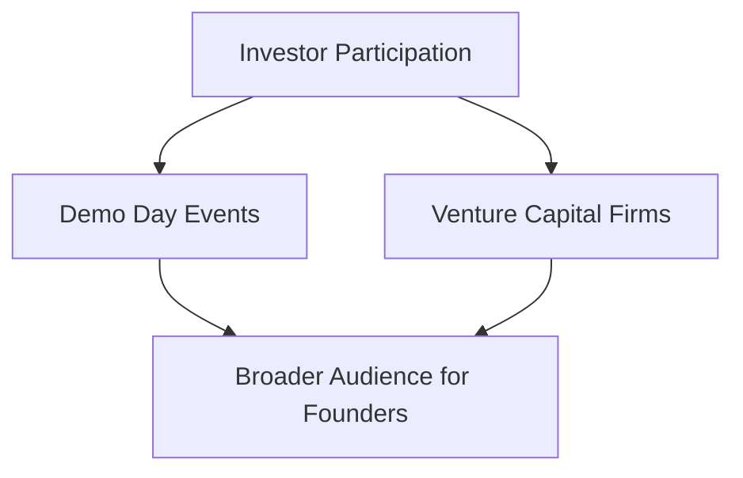

```mermaid
bar
    title Funding Structures in 2025
    x-axis Funding Model
    y-axis Number of Startups
    "Traditional Equity": 50
    "Revenue-Based Financing": 30
```



```mermaid
line
    title Investment Capital Increase Over Years
    x-axis Year
    y-axis Amount Invested (in millions)
    2022: 200
    2023: 350
    2024: 500
    2025: 800
```

```mermaid
bar
    title Emphasis on Sustainability
    x-axis Investment Focus
    y-axis Percentage of Total Investment
    "Climate Tech": 45
    "Renewable Energy": 35
    "Sustainable Food Systems": 20
```





```mermaid
line
    title Data-Driven Decision Making
    x-axis Time
    y-axis Efficiency Improvement (%)
    "Q1 2023": 10
    "Q2 2023": 25
    "Q3 2023": 40
    "Q4 2023": 60
```

```mermaid
bar
    title Health Tech Focus
    x-axis Investment Type
    y-axis Number of Startups Funded
    "Telemedicine": 20
    "Wearables": 15
    "Digital Health": 25
```



This collection of visualizations captures the key trends and initiatives from Y Combinator's recent strategies, making insights clear and actionable for stakeholders in the startup ecosystem.